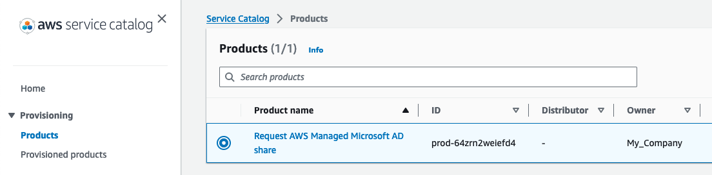
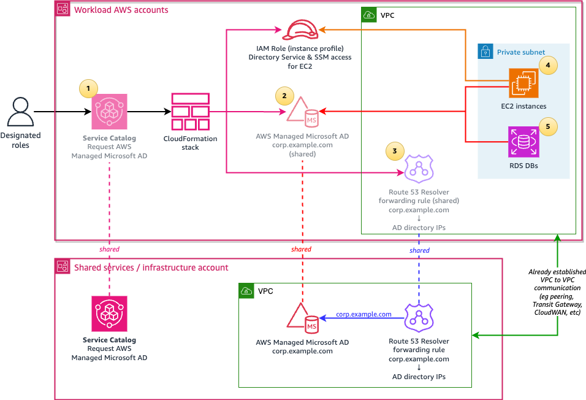

# Providing self-service multi-account access to AWS Managed Microsoft AD

This repository shows an example of how you can create a self-service Service Catalog product for sharing a central AWS Managed Microsoft AD instance, along with the required Route 53 DNS rules.

There is a [cost](https://aws.amazon.com/directoryservice/pricing/) associated with sharing Managed AD instances with other accounts, and thus it may not be cost-effective to share it to every AWS account in the organization. Using a Service Catalog product allows AWS account owners in the AWS Organization to request for the share if they need it, and stop the share when they don't.

Note that it's assumed that all the VPCs in the AWS accounts are able to communicate with the VPC associated with the AWS Managed Micrsoft AD instance, as that is the prerequsite for this to work. For example, you can use [AWS Transit Gateway](https://aws.amazon.com/transit-gateway/) and the [Network Orchestrator for AWS Transit Gateway](https://aws.amazon.com/solutions/implementations/network-orchestration-aws-transit-gateway/), or [AWS Cloud WAN](https://aws.amazon.com/cloud-wan/) to connect all the VPCs together. 

Once the Service Catalog product to request access to a shared AWS Managed Microsoft AD instance is created, the Managed Microsoft AD instance immediately then appears in their account under "Directories shared with me". The shared AWS Managed Microsoft AD instance can then be used in the AWS account for [seamless EC2 domain joins](https://docs.aws.amazon.com/directoryservice/latest/admin-guide/step4_test_ec2_access.html), or [Amazon RDS instances](https://aws.amazon.com/blogs/database/joining-your-amazon-rds-instances-across-accounts-to-a-single-shared-domain/).



This is the high level architecture:



1.	A shared AWS Service Catalog product is available on all AWS accounts in your AWS Organization, or on selected OUs, which allows users using designated AWS IAM Identity Center permission sets or IAM roles to request for an AWS Managed Microsoft AD share.
2.	The Service Catalog product creates a CloudFormation stack that orchestrates sharing the central AWS Managed Microsoft AD directory, that may optionally have [trust relationships](https://docs.aws.amazon.com/directoryservice/latest/admin-guide/ms_ad_tutorial_setup_trust.html) configured with your self-managed Active Directory domains, to the requesting AWS account. 
3.	The CloudFormation stack also associates a shared Route 53 Resolver forwarding rule, to forward DNS queries for the AD domain, such as corp.example.com, to the AWS Managed Microsoft AD IP addresses.
4.	[Windows](https://docs.aws.amazon.com/directoryservice/latest/admin-guide/launching_instance.html) and [Linux](https://docs.aws.amazon.com/directoryservice/latest/admin-guide/seamlessly_join_linux_instance.html) EC2 instances with supported AMIs can seamlessly join the AWS Managed Microsoft AD directory, using an instance profile IAM role that gives it the required permissions.
5.	RDS for SQL Server, RDS for MySQL, and RDS for PostgreSQL, Aurora PostgreSQL, and Aurora MySQL can be configured to use authenticate users using the shared AWS Managed Microsoft AD directory.


#### Costs

There is a [relatively small cost](https://aws.amazon.com/servicecatalog/pricing/) for the Service Catalog product that allows the self-service sharing, assuming you already have AWS Managed Microsoft AD and the networking infrastructure to support it.

If you will be creating a new AWS Managed Microsoft AD instance using the example in this repository, the main costs would be:
-	[AWS Managed Microsoft AD Enterprise Edition](https://aws.amazon.com/directoryservice/pricing/). The Standard edition only supports being shared with [5 AWS accounts, vs 125 accounts](https://docs.aws.amazon.com/directoryservice/latest/admin-guide/ms_ad_limits.html) in Enterprise. 
- Each Enterprise Managed AD share with an AWS account has a [cost](https://aws.amazon.com/directoryservice/pricing) per hour.
- [t3.small Windows instance](https://aws.amazon.com/ec2/pricing/on-demand/) for management. This is only used for configuring AWS Managed Microsoft AD, and can be shut down when not required.
- [Route 53 Resolver Endpoints](https://aws.amazon.com/route53/pricing/#Route_53_Resolver_Endpoints) for DNS to work.

It's assumed that you already have the cross account networking infrastructure to support this in place, for example [AWS Transit Gateway](https://aws.amazon.com/transit-gateway/) or [AWS Cloud WAN](https://aws.amazon.com/cloud-wan/), which has it's own costs, or VPC peering for testing.


There are four directories:

1. `VPC_sample`: Basic sample VPC template if you want to quickly test this solution. VPC peering needs to be configured manually.
2. `AWS_Managed_Microsoft_AD_instance`: Creates the Managed AD directory
3. `Route53_DNS_Rule`: Creates the Route 53 Resolver shared forwarding rules.
4. `Service_Catalog_Product`: AWS Service Catalog components for requesting Managed AD in a different account.


# Installation Steps

## Requirements

To try out of the solution, you will need at least:
- Have administrator access to an AWS Organizations environment.
- Have an AWS account that would host the AWS Managed Microsoft AD directory, for example a shared services/infrastructure account.
- Have one or more AWS accounts that would consume the Service Catalog product, for example a test account to begin with.
- Authentication via AWS IAM Identity Center, or alternatively federated with fixed IAM role names in each AWS account.
- VPCs set up in each of the above accounts, in a way that allows them to communicate, for example using [Network Orchestrator for AWS Transit Gateway](https://aws.amazon.com/solutions/implementations/network-orchestration-aws-transit-gateway/). Note that the VPCs would need to be able to reach the endpoint `ds.<region>.amazonaws.com`, either via the internet or via interface endpoints [in the regions that are supported](https://docs.aws.amazon.com/directoryservice/latest/admin-guide/vpc-interface-endpoints.html),  If you don't have a VPC in your test environment, see the next section.


### (if required) Sample VPCs

Skip this step if you already have VPCs that can communicate with each other.

If you want to test this across two accounts, and do not have VPCs set up already, a sample VPC template is included that you can use for quickly testing:

- Log into the AWS account that will host the directory, go to CloudFormation, and create a stack using the [Test_VPC.yaml](VPC_sample/Test_VPC.yaml) template with the following parameters as an example:
- - **Stack name**: Example: VPC-managed-ad-test
- - **VPC name**: Example: Test-AWS-Managed-Microsoft-AD
- - **VPC network**: Example: 10.111.0.0
- - **CIDR prefix**: Example: 24
- - **Create NAT GW in every AZ**: Example: No

- Create the stack.

- Log into the AWS account where you will test requesting for the share, go to CloudFormation, and create a stack using the [Test_VPC.yaml](VPC_sample/Test_VPC.yaml) template with the following parameters as an examplee:
- - **Stack name**: Example: VPC-request-ad-test
- - **VPC name**: Example: Test-Request-AD
- - **VPC network**: Example: 10.222.0.0
- - **CIDR prefix**: Example: 24
- - **Create NAT GW in every AZ**: Example: No

Then manually peer these VPCs together using [these instructions](https://docs.aws.amazon.com/vpc/latest/peering/working-with-vpc-peering.html), making sure that you updated the private route tables on both VPCs as specified [here](https://docs.aws.amazon.com/vpc/latest/peering/vpc-peering-routing.html).


### (required) AWS Organizations configuration

There are two changes needed on the management AWS account:
- Service Catalog Organizations sharing needs to be enabled, and the account hosting the Managed AD directory needs to be [one of the](https://docs.aws.amazon.com/servicecatalog/latest/adminguide/limits.html) delegated administrators for Service Catalog.
- [Resource Access Manager (RAM)](https://aws.amazon.com/ram/) sharing needs to be enabled for sharing Route 53 resolver rules.

To enable the above, log into the AWS management (billing) account, launch CloudShell, and run these commands, replacing the account ID of the first line:

```bash
managed_ad_account=012345678901  # REPLACE ME
aws ram enable-sharing-with-aws-organization
aws servicecatalog enable-aws-organizations-access
aws organizations enable-aws-service-access --service-principal ds.amazonaws.com
aws organizations register-delegated-administrator --account-id $managed_ad_account --service-principal servicecatalog.amazonaws.com
```

## (if required) AWS Managed Microsoft AD

You can skip this step if you already have an AWS Managed Microsoft AD instance; just note down the Directory ID.

The [included CloudFormation template](AWS_Managed_Microsoft_AD_instance/AWS_Managed_Microsoft_AD.yaml) creates a Managed AD instance with:
- Logging, via CloudWatch Logs.
- Directory status notifications with SNS (eg. if the directory is Impaired or Inoperable).
- Randomly generated passwords for the Administrator user kept in Secrets Manager.

To create the stack:

- Log into the AWS account that will host the directory, go to CloudFormation, and create a stack using the [AWS_Managed_Microsoft_AD.yaml](AWS_Managed_Microsoft_AD_instance/AWS_Managed_Microsoft_AD.yaml) template with the following parameters as an example:
- - **Stack name**: Managed-AD
- - **VpcId**: VPC.
- - **SubnetID1/SubnetID2**: Private subnet IDs, each in different AZs.
- - **Directory DNS name**: (for example) corp.example.com
- - **Directory short name**: (for example) CORP
- - **Edition**: You can select Standard for testing, but to go beyond 5 shares, you need Enterprise.
- - **LogRetentionDays**: The number of days to retain the Managed AD logs for
- - **Notification Email Address 01/02**: (optional) Email address for Managed AD directory status notifications.
- - **Create EC2 Management Host**: Yes

If the stack creation because of an error on the subnet association about availability zone restrictions in your region, try another subnet in a different AZ.

The "Outputs" of the stack would contain the the Managed AD IP addresses and other information.

To access the automatically generated “Admin” password, in the Outputs tab, click on the AWS Secrets Manager link next to “ManagedADPassword”, and click on “Retrieve secret value”.

Optionally, to configure Active Directory, click on link next to “RDPWebURL”, which forwards you to Fleet Manager, a capability of AWS Systems Manager. Enter the username “Admin”, with the password copied from Secrets Manager earlier, and click on Connect. You can then [create a user](https://docs.aws.amazon.com/directoryservice/latest/admin-guide/ms_ad_manage_users_groups_create_user.html) by opening the Active Directory Users and Computer tool that is pre-installed.

If you wish to limit the IP range that can access the Managed AD instance, go to EC2 -> Security Groups, and update the security group with the description "AWS created security group for d-123456 directory controllers", and replace the 0.0.0.0/0 with the required IP CIDRs (the summary of the VPCs across the AWS Organization).


## Route 53 Resolver Rules

The following steps allow you to create a shared Route 53 Resolver forwarding rules to forward DNS queries in the requester VPC for the Managed AD domain name to the Managed AD directory instance IP addresses. If you have your own mechanism for managing cross-account/VPC DNS rules, you can configure that accordingly, otherwise continue reading.

- Log into the AWS account that will host the directory, go to CloudFormation, and create a stack using the [Route53-Rules.yaml ](Route53_DNS_Rule/Route53-Rules.yaml) template.
- In the Parameters, for the “Principal”, enter the Principal ARN or account ID to share the Route 53 Resolver rule with. If you are testing with a specific account in the AWS Organization, you can enter the account ID here. Alternatively, if you want to share the rule with the entire Organization, paste the command listed in the parameter description in AWS CloudShell to get the ARN.
- Then select the VPC where the directory is located, and the associated private subnets.
- Optionally, if you plan to configure a trust relationship with another domain, you can enter details about the other domain to configure the DNS rules (the trust has to be [manually set up](https://docs.aws.amazon.com/directoryservice/latest/admin-guide/ms_ad_tutorial_setup_trust.html) after the DNS is configured). 
- Finally, enter the details about your AWS Managed Microsoft AD directory. If you used the CloudFormation template in this repo, you can leave the parameters blank to import the values automatically.

If you get an error about the AWSServiceRoleForResourceAccessManager already existing, delete the stack, and recreate it with the “Create RAM Service Linked IAM Role?” parameter set to No.


## Service Catalog Product

Finally, run an included script that creates the CloudFormation templates required for the Service Catalog product for sharing the AWS Managed Microsoft AD directory.

- Log into the AWS account hosting the Managed AD instance, and go to the appropriate region, and launch CloudShell.

- In the terminal, enter the following commands:

```
git clone https://github.com/aws-samples/service-catalog-share-aws-managed-microsoft-ad
cd service-catalog-share-aws-managed-microsoft-ad/Service_Catalog_Product
bash ./install.sh
```

The script will ask for the following information:

-	The Service Catalog “provider” display name, which can be your company or organization name. 
-	The Service Catalog product version, which defaults to “v1”. Increment this if you make a change in the product CloudFormation template file.
-	The Principal type that will be using the Service Catalog product. If you are using AWS IAM Identity Center, enter “IAM_Identity_Center_Permission_Set”. Otherwise, if you have federated IAM roles configured, select “IAM role name”.
-	The Principal(s) that will have access to the Service Catalog product across the AWS accounts. If you are using IAM Identity Center, this will be a permission set name, for example “AWSAdministratorAccess”. Otherwise, enter the IAM role name. 

The script then creates the following CloudFormation stacks:

- `Managed-AD-Sharing-Hub.yaml`: creates an Amazon SNS topic that triggers an AWS Lambda function to share the directory with the calling account. 
- `Managed-AD-Sharing-SC-Bucket.yaml`: creates an S3 bucket that contains the “Managed-AD-Sharing-Product.yaml” CloudFormation template file associated with the Service Catalog product. When the Service Catalog user launches the product, and thus the CloudFormation stack, it calls the SNS topic created earlier, as well as associates the shared Route 53 Resolver forwarding rule created earlier with the VPC given in the product parameters.
- `Managed-AD-Sharing-ServiceCatalog.yaml`: creates a Service Catalog Portfolio and Product using the S3 bucket from the previous step, and gives permissions to the required principals to launch the product.

After the script finishes the installation, it asks whether it should automatically share this Service Catalog portfolio with the entire AWS Organization, or a specific account, or whether you will configure sharing to specific OUs manually. 

To manually configuring sharing with an OU, go to Service Catalog -> Portfolios, select “Request AWS Managed Microsoft AD share”, and in the “Share” tab, add a share, and select “AWS Organization”, and select the OU. Make sure you check the "Principal Sharing" checkbox, and click on Share. The product will be shared to all accounts and child OUs within the selected OU. 

You can then log into an AWS account that has access to the shared Service Catalog product, ensuring you are logged in with the designated IAM Identity Center Permission Set or IAM role. Launch the product in Service Catalog to request for an AWS Managed Microsoft AD share.


## Additional notes

Users requesting access to Managed AD via Service Catalog would need Administrator level access in their account to be able to create the [IAM roles](Service_Catalog_Product/02_Service_Catalog_Product_template_bucket/bucket_contents/Managed-AD-Sharing-Product.yaml) associated with the Lambda function for the custom CloudFormation resource that triggers the request, as well as the EC2 instance profile for AWS Systems Manager. If you want to grant users without Administrator access to their accounts the ability to request Managed AD, there are two options:
1) You can pre-create the Lambda function and IAM roles that are in [Managed-AD-Sharing-Product.yaml](Service_Catalog_Product/02_Service_Catalog_Product_template_bucket/bucket_contents/Managed-AD-Sharing-Product.yaml) across all accounts in advance (for example using [Customizations for Control Tower](https://docs.aws.amazon.com/controltower/latest/userguide/customize-landing-zone.html) or [CloudFormation StackSets](https://docs.aws.amazon.com/AWSCloudFormation/latest/UserGuide/what-is-cfnstacksets.html)). The Service Catalog Product would end up only having the CloudFormation Custom resources to request and accept the Managed AD share. You can then have their IAM permissions only require the ability to do a `s3:GetObject` on the service catalog buckets (`arn:aws:s3:::sc-*`), have the specific Route53 Resolver rule association/disassociation and list permissions, publishing to the SNS topic in the Managed AD account, invoking the Lambda function, and the `arn:aws:iam::aws:policy/AWSServiceCatalogEndUserFullAccess` IAM Managed Policy.
2) You can create a [permission boundary](https://docs.aws.amazon.com/IAM/latest/UserGuide/access_policies_boundaries.html) in each account in advance, and modify the [Managed-AD-Sharing-Product.yaml](Service_Catalog_Product/02_Service_Catalog_Product_template_bucket/bucket_contents/Managed-AD-Sharing-Product.yaml) IAM role resource to refer to that permission boundary. You can then grant the same permissions as option 1, but with IAM role creation/deletion permissions with a condition requiring the permission boundary to be set.

You can expand this solution across regions, by enabling AWS Managed Microsoft AD [multi-region replication](https://docs.aws.amazon.com/directoryservice/latest/admin-guide/ms_ad_configure_multi_region_replication.html), ensuring that there’s multi-region network connectivity, and then instantiating this Service Catalog solution in the additional region(s). 

If you want to make the solution work where you have multiple VPCs in each AWS account, you can modify the solution to split the product, one for requesting a directory share, and another for the Route 53 VPC association. The latter product can be called multiple times as needed, or can be modified to ask for multiple VPC IDs. You will also want to remove the CloudFormation Output Export, as it otherwise would not allow you to launch the same product in the same account twice.

## Cleanup

There are pay-as-you-go costs associated with running an AWS Managed Microsoft AD directory, sharing the directory, the EC2 management host instance, the Route 53 Resolver Endpoints, and the VPC resources like NAT Gateways if created just for the purposes of testing this solution.

To avoid ongoing charges, follow these steps:

- In the test workload account(s):
- - Terminate any test EC2 instances or RDS databases created to test the AWS Managed Microsoft AD integration.
- - Go to Service Catalog Provisioned products, and terminate the associated provisioned product(s). This unshares the directory from the requesting account, and disassociates the shared Route 53 resolver rule.
- In the AWS account hosting the directory:
- - Go to Service Catalog, Portfolios, click on “Request AWS Managed Microsoft AD share”, go to the “Share” tab, and select the items in the list, and click on Actions -> Unshare.
- - Go to CloudFormation, and delete the “Managed-AD-Sharing-Service-Catalog” stack. 
- - Go to S3, select the bucket starting with “managed-ad-sharing-sc-bucket”, click on “Empty”, and empty the bucket.
- - Go to CloudFormation, and delete the following stacks in order: 1) Managed-AD-Sharing-SC-Bucket, 2) Managed-AD-Sharing-Hub, 3) The stack with the Route 53 rules 4) The AWS Managed Microsoft AD stack 


## Security

See [CONTRIBUTING](CONTRIBUTING.md#security-issue-notifications) for more information.

## License

This library is licensed under the MIT-0 License. See the LICENSE file.
